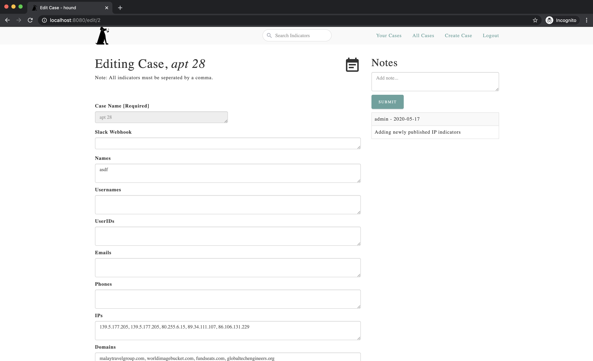

# Hound - Indicator Monitoring

<div align="center"></div>

## What is Hound?
**Hound** is an IOC monitoring tool. Hound allows users to monitor and alert on Indicators against intelligence service such as **Crowdstrike**, **Flashpoint**, and **VirusTotal**.
Easily integrate Hound with your user data for monitoring bad actors on your platform.

## How does Hound work?
Every hour IOCs will be check against datasources for any new activity. If new activity is seen in the past hour, a dedicated Slack channel can be notified with details surrounding the IOC and the activity. To use Slack, add your Slack Webhook to `config.json`.
Don't use Slack? No sweat. Hound will ingest any new activity it sees and store the details within a given Case.

<div align="center"></div>

## Integrations
### Current integrations and capabilities
Currently Hound supports **VirusTotal**, **PolySwarm**, **Crowdstrike**, **Flashpoint**, and is ready to be integrated with any Postgres data source.

|   | Postgres* | VirusTotal  | PolySwarm | CrowdStrike | Flashpoint |
| ------------- | ------------- | ------------- | ------------- | ------------- | ------------- |
| **Name** | ✔ |  |  | ✔ | ✔ |
| **Username** | ✔  | ✔ |  | ✔ | ✔ |
| **UserID** | ✔ |  |  |  |  |
| **Email** | ✔ |  |  | ✔ | ✔ |
| **Phone** | ✔ |  |  | ✔ | ✔ |
| **IPAddress** | ✔ | ✔ | ✔ | ✔ | ✔ |
| **Keyword** | ✔ | ✔  | ✔ | ✔ | ✔ |
| **Domain** | ✔ | ✔ |  | ✔ | ✔ |
| **URL** | ✔ | ✔ |  | ✔ | ✔ |
| **BTC Address** | ✔ |  |  | ✔ | ✔ |
| **sha256** | ✔ | ✔ | ✔ | ✔ | ✔ |
| **sha1** | ✔ | ✔ | ✔ | ✔ | ✔ |
| **md5** | ✔ | ✔ | ✔ | ✔ | ✔ |
| **Filename** | ✔ | ✔ |  | ✔ | ✔ |

### Future Integrations
To integrate other data sources, check out `runner.py` where all IOCs can be delivered to a new integration script as a Python Dictionary:

```
all_iocs = {
	"name": names,
	"username": usernames,
	"userid": userids,
	"email": emails,
	"phone": phones,
	"ip": ips,
	"keyword": keywords,
	"domain": domains,
	"url": urls,
	"btcaddress": btcaddresses,
	"sha256": sha256s,
	"sha1": sha1s,
	"md5": md5s,
	"filename": filenames
}
```

To access each IOC from the Dictionary:
```
for i in all_iocs:
    for ioc_data in all_iocs[i]:
        ioc = ioc_data.indicator
        print(ioc)
```

Please see `integrations/flashpointchecker.py` for a working example on how each IOC is accessed.

## Running Hound

1. First setup your `config.json` file with all the required usernames and passwords.
2. From the command line: `$ docker-compose up --build`
3. Navigate to [http://localhost:8080/](http://localhost:8080/)

## Authentication and User Management
Users are managed by an Admin account whos credentials are declared in `config.json`. To activate the Admin account, navigate to `http://localhost:8080/auth/createadmin`. From there new users can be managed by the Admin at `http://localhost:8080/auth/users`

## Screenshots
### All Cases
<div align="center"></div>

### Case View
<div align="center"></div>

### Ingested Events
<div align="center"></div>

### Admin View
<div align="center"></div>